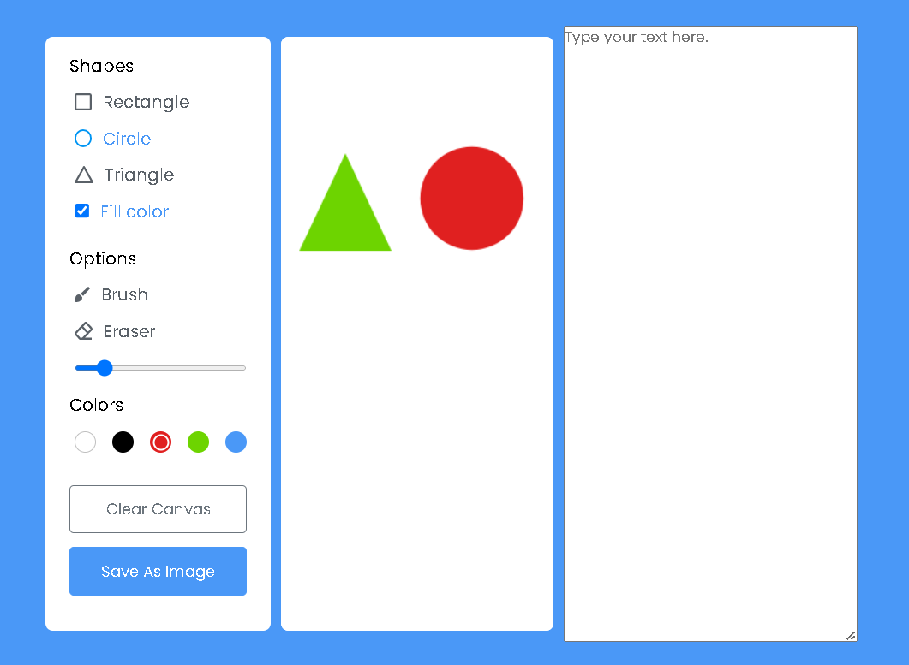

# SignalR Drawing & Text Document Web-App

This is a simple web app created with ASP.NET Core Razor pages and SignalR that allows users to collaboratively use a drawing canvas and text area with real-time updates. 

All of the SignalR implementations were completed by myself. Credit for the drawing app core features goes to CodingNepal. The original source code that the web page is based off of can be found [here](https://www.codingnepalweb.com/build-drawing-app-html-canvas-javascript/). The only difference is the textarea element and SignalR features that I added in.

This web app can also be downloaded and ran via Docker:
- In a terminal, run `docker pull conkythegreat/signalr-drawing-textdoc-app`
- Run `docker run --publish 8000:80 conkythegreat/signalr-drawing-textdoc-app`
- In your web browser, navigate to `localhost:8000` and the web app should be running
- Open a 2nd window and also navigate to `localhost:8000`. Any changes to the drawing canvas and textarea element are displayed in real-time in both windows

